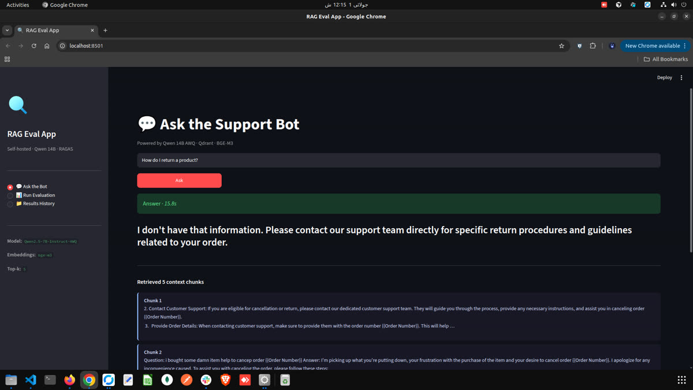
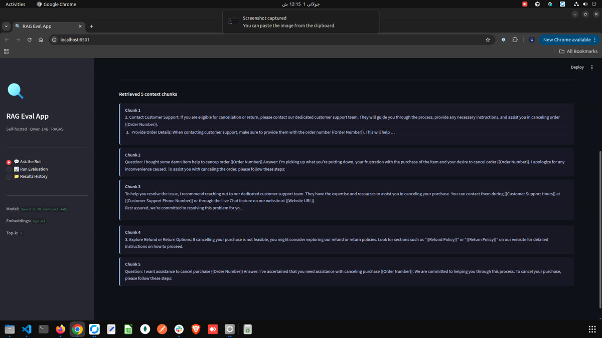
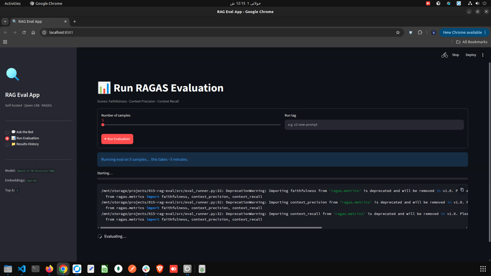
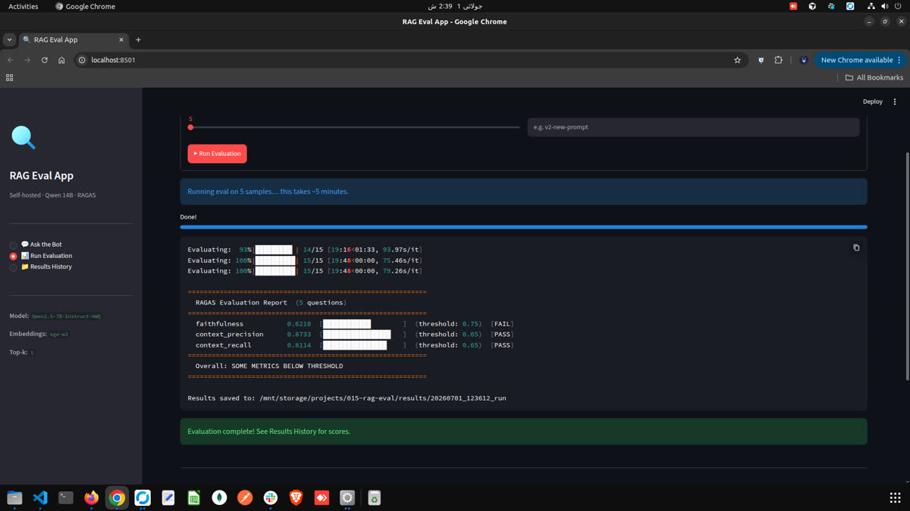
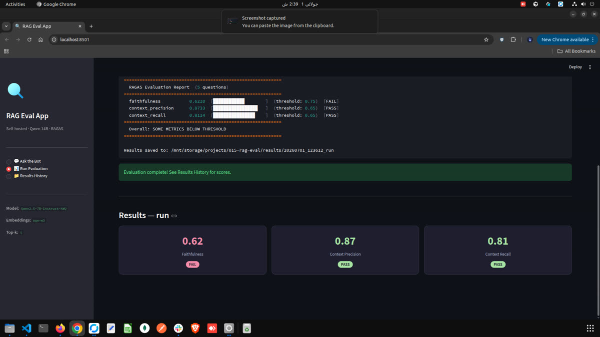
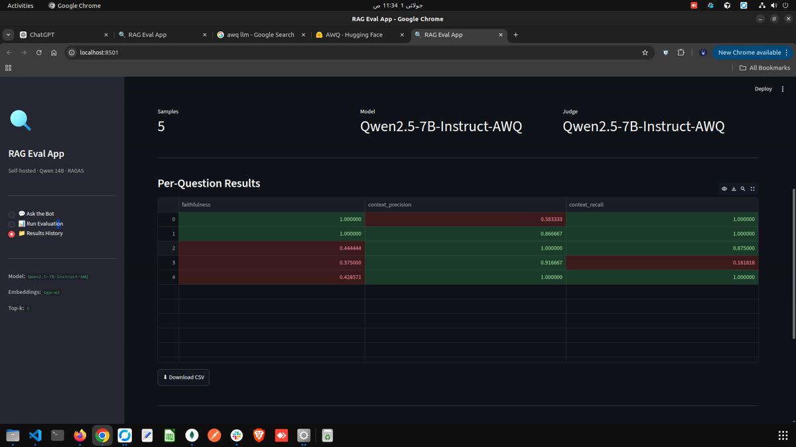

# RAG Evaluation App

Self-hosted RAG evaluation pipeline for a customer support bot.

**Stack:** LangChain · Qdrant · BGE-M3 · Qwen 14B AWQ (app) · Qwen 7B (judge) · RAGAS · Langfuse

---

## What this does

1. **Ingests** the Bitext customer-support dataset into Qdrant (or your own docs)
2. **Answers** support questions via a LangChain RAG pipeline using your local Qwen model
3. **Evaluates** answer quality with RAGAS (faithfulness, relevancy, context precision/recall)
4. **Traces** every query in self-hosted Langfuse (context, prompt, answer, latency)
5. **Reports** per-run scores with pass/fail thresholds — saved to `results/`

---

## Hardware requirement

- NVIDIA RTX 3090 (24 GB VRAM)
- Two vLLM processes recommended (see below), or run eval off-hours on the same GPU

---

## Project structure

```
015-rag-eval/
├── config.yaml          # all settings (models, Qdrant, RAGAS thresholds)
├── .env.example         # copy to .env and fill in Langfuse keys
├── requirements.txt
├── data/                # HuggingFace dataset cache
├── results/             # eval run outputs (JSON + CSV per run)
└── src/
    ├── ingest.py        # load dataset → chunk → embed → Qdrant
    ├── rag_pipeline.py  # LangChain RAG (retrieve + generate)
    ├── eval_runner.py   # RAGAS evaluation loop
    └── langfuse_tracer.py  # Langfuse tracing wrapper
```

---

## Setup

### 1. Install dependencies

```bash
python -m venv .venv
source .venv/bin/activate
pip install -r requirements.txt
```

### 2. Copy env file

```bash
cp .env.example .env
# Edit .env with your Langfuse keys (if using tracing)
```

### 3. Start Qdrant

```bash
docker run -d --name qdrant \
  -p 6333:6333 \
  -v $(pwd)/data/qdrant:/qdrant/storage \
  qdrant/qdrant
```

### 4. Start vLLM — App model (Qwen 14B AWQ)

```bash
VLLM_USE_FLASHINFER_SAMPLER=0 vllm serve Qwen/Qwen2.5-14B-Instruct-AWQ \
  --quantization awq_marlin \
  --gpu-memory-utilization 0.85 \
  --max-model-len 4096 \
  --port 8000
```

### 5. Start vLLM — Judge model (Qwen 7B, run separately or off-hours)

```bash
vllm serve Qwen/Qwen2.5-7B-Instruct \
  --gpu-memory-utilization 0.85 \
  --max-model-len 4096 \
  --port 8001
```

> **Note:** Running both on one 3090 is tight. Recommended: run eval nightly when the app model is stopped, or use CPU inference for the judge (`--device cpu` in vLLM, slower but works).

### 6. Start Langfuse (optional, for tracing)

```bash
# Clone Langfuse and start with Docker Compose
git clone https://github.com/langfuse/langfuse.git
cd langfuse && docker compose up -d
# Open http://localhost:3000 → create project → copy keys to .env
```

---

## Running the pipeline

### Step 1 — Ingest the dataset

```bash
python src/ingest.py
# or override sample size:
python src/ingest.py --sample 500
```

This loads the Bitext support dataset, chunks it, embeds with BGE-M3, and stores in Qdrant.

### Step 2 — Test a single query

```bash
python src/rag_pipeline.py --question "How do I cancel my subscription?"
```

### Step 3 — Run RAGAS evaluation

```bash
python src/eval_runner.py --samples 50
# with a label for the run:
python src/eval_runner.py --samples 50 --tag "v1-baseline"
```

Output example:

```
============================================================
  RAGAS Evaluation Report  (50 questions)
============================================================
  faithfulness           0.8840  [████████████████    ]  (threshold: 0.75)  [PASS]
  answer_relevancy       0.8210  [████████████████    ]  (threshold: 0.70)  [PASS]
  context_precision      0.7650  [███████████████     ]  (threshold: 0.65)  [PASS]
  context_recall         0.7120  [██████████████      ]  (threshold: 0.65)  [PASS]
============================================================
  Overall: ALL METRICS PASSED
============================================================

Results saved to: results/20240629_153000_v1-baseline/
```

Results are saved to:
- `results/<run_id>/summary.json` — scores + threshold flags
- `results/<run_id>/per_question.csv` — per-question breakdown

---

## Configuration

All settings live in `config.yaml`. Key options:

| Key | Default | Description |
|-----|---------|-------------|
| `llm.app_model.model` | Qwen 14B AWQ | Main support bot model |
| `llm.judge_model.model` | Qwen 7B | RAGAS scoring model |
| `retrieval.top_k` | 5 | Chunks retrieved per query |
| `chunking.chunk_size` | 512 | Tokens per chunk |
| `dataset.sample_size` | 100 | Rows for eval |
| `eval.thresholds.*` | 0.65–0.75 | Fail thresholds per metric |

---

## Adding your own support docs

Replace the Bitext dataset with your real content in `src/ingest.py`:

```python
# Instead of load_dataset(), load your own docs:
from langchain_community.document_loaders import DirectoryLoader
loader = DirectoryLoader("./my_docs/", glob="**/*.md")
docs = loader.load()
```

Then create your golden dataset in `data/golden_dataset.json`:

```json
[
  {
    "question": "How do I cancel my subscription?",
    "ground_truth": "Go to Settings > Billing > Cancel Plan.",
    "reference_contexts": ["To cancel, navigate to Settings..."]
  }
]
```

---

## Metrics reference

| Metric | What it measures | Ideal |
|--------|-----------------|-------|
| **Faithfulness** | Answer is grounded in retrieved context (no hallucination) | > 0.80 |
| **Answer Relevancy** | Answer addresses the question asked | > 0.75 |
| **Context Precision** | Retrieved chunks are relevant (not noise) | > 0.70 |
| **Context Recall** | All needed information was retrieved | > 0.70 |

---

## Screenshots

### Ask the Bot
<p align="center">
  
  
</p>

### Run Evaluation
<p align="center">
  
  
</p>

### Results History
<p align="center">
  
  
</p>
